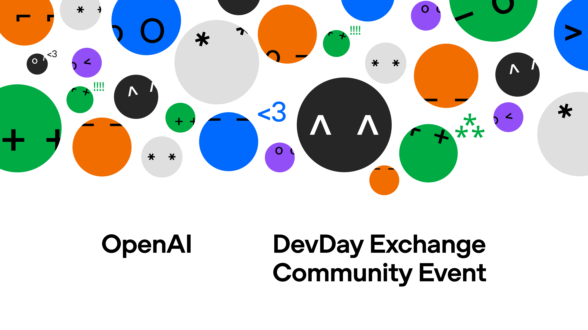

<a id="topo"></a>
<div align="center">

<a href="https://luma.com/wzk8q92k"></a>

<h1>DevDay Exchange Community · Rio de Janeiro 2026</h1>

<p><strong>Dos anúncios à prática. Da primeira ideia a uma entrega que você consegue revisar.</strong></p>
<p><strong>Dots · Codex CLI · Codex Cloud · Decisions API</strong></p>
<p>24 de outubro de 2026 · IBMEC Barra · Rio de Janeiro<br>Material em português com Glaucia Lemos</p>

<p>
<a href="https://nextjs.org/docs"></a>
<a href="https://react.dev/"></a>
<a href="https://www.typescriptlang.org/"></a>
</p>
<p>
<a href="https://nodejs.org/en/download"></a>
<a href="https://tailwindcss.com/docs"></a>
<a href="https://lucide.dev/"></a>
<a href="https://playwright.dev/"></a>
</p>

<p>
<a href="https://github.com/glaucia86/devday-exchange-community-rio-2026/actions/workflows/check-labs.yml"></a>
<a href="LICENSE"></a>
</p>
<p><a href="https://luma.com/wzk8q92k">Inscreva-se</a> · <a href="#labs">Escolha seu LAB</a> · <a href="#executar">Execute a demo</a> · <a href="docs/roteiro-de-palco.md">Roteiro de palco</a> · <a href="docs/guia-apresentadora.md">Guia da apresentadora</a> · <a href="#sobre-mim">Sobre mim</a></p>
</div>

---

## 📑 Sumário

- [Conheça o encontro](#encontro)
- [O que você vai encontrar](#material)
- [Escolha seu LAB](#labs)
- [Prepare seu ambiente](#preparacao)
- [Execute a demo Alô, TI](#executar)
- [Roteiro de palco](docs/roteiro-de-palco.md)
- [Verifique seu ambiente](#validar)
- [Estado do projeto](#estado)
- [Guia da apresentadora](#apresentadora)
- [Checklist para o encontro](#checklist)
- [Explore o repositório](#estrutura)
- [Segurança e licença](#seguranca)
- [Sobre mim](#sobre-mim)

<a id="encontro"></a>
## 🗓️ Conheça o encontro

O **DevDay Exchange Community Rio 2026** reúne desenvolvedores, estudantes e builders para conversar sobre os aprendizados do OpenAI DevDay 2026 e experimentar suas possibilidades com exemplos práticos.

| Informação | Detalhes |
| --- | --- |
| **Data** | Sábado, 24 de outubro de 2026 |
| **Horário publicado** | 09h00 às 14h30, horário de Brasília |
| **Local** | IBMEC Barra |
| **Endereço** | Av. Armando Lombardi, 940, Barra da Tijuca, Rio de Janeiro |
| **Organização** | [Glaucia Lemos](https://github.com/glaucia86), Codex Ambassador |
| **Inscrição e atualizações** | [Página do evento no Luma](https://luma.com/wzk8q92k) |

A abertura terá um recap do OpenAI DevDay, seguido dos temas técnicos e da troca com a comunidade. Consulte a [programação](docs/programacao.md) e a página do evento para os detalhes de participação.

<a id="material"></a>
## 🧭 O que você vai encontrar

Este repositório reúne **material original em português** para acompanhar o encontro e continuar praticando depois dele.

**No evento, Glaucia conduz as demonstrações e o público acompanha. Os LABS são para fazer em casa depois, reproduzindo as mesmas demonstrações. Não haverá execução coletiva dos exercícios durante a apresentação.**

O fio condutor dos LABS de código e de voz é o suporte fictício da Aurora: revisar os relatos, melhorar o encaminhamento, revisar uma entrega remota e conversar por voz antes de confirmar um ticket simulado. Dots acompanha outra fonte, pública e real: as issues e os pull requests deste repositório. Cada LAB tem o mesmo cenário, pedido e critérios da demonstração correspondente no [guia da apresentadora](docs/guia-apresentadora.md).


| Se você quer… | Comece por… |
| --- | --- |
| Experimentar um dos temas | Os [quatro LABS](#labs), com requisitos, passos e resultados esperados |
| Praticar uma mudança de código | O [encaminhador de chamados](exercises/ticket-router/README.md), com starter e solução |
| Explorar uma interface interativa | A demo [Alô, TI](apps/decisions/README.md), demo fictícia do LAB Decisions |
| Preparar a apresentação | O [roteiro de palco](docs/roteiro-de-palco.md) e o [guia da apresentadora](docs/guia-apresentadora.md) |
| Entender o que foi verificado | O [registro de validação](docs/validacao.md) |
| Aprofundar os assuntos | As [referências](docs/referencias.md) |

Conhecer o básico de JavaScript/TypeScript, terminal e Git ajuda na parte de código. Cada LAB apresenta sua própria preparação.

> [!IMPORTANT]
> A demo Alô, TI funciona atualmente em **modo mock**, com cenários fictícios. Os adaptadores GPT-Live + Decisions estão implementados em uma aba separada, desativada por padrão. Ainda não houve ensaio com API e áudio reais; testes com fixtures não comprovam a experiência ponta a ponta.

<a id="labs"></a>
## 🧪 Escolha seu LAB

São **quatro demonstrações, cada uma com um LAB para reproduzir em casa**. Os roteiros são independentes para estudo. O de Dots usa uma fonte pública real; os demais seguem o contexto de suporte fictício. Esta ordem facilita a navegação; não define novos horários de palco.

| Demonstração | O que você vai reproduzir em casa | Abrir o LAB |
| --- | --- | --- |
| **Dots** | Atribuir uma responsabilidade contínua e conferir o que mudou nas issues e nos pull requests públicos | [Cenário e passo a passo](labs/01-dots/README.md) |
| **Codex CLI** | Acompanhar uma mudança no terminal, inspecionar o diff e verificar testes | [LAB do CLI](labs/codex-cli/README.md) |
| **Codex Cloud** | Revisar uma candidata com testes verdes, reproduzir a regressão e conferir uma correção remota | [LAB do Cloud](labs/codex-cloud/README.md) |
| **Decisions API** | Conversar por voz, corrigir o relato e revisar o ticket; com alternativa simulada e exercícios de contrato | [LAB Decisions](labs/02-decisions-typescript/README.md) |

CLI e Cloud usam o mesmo [contrato de encaminhamento fictício](exercises/ticket-router/README.md), com pontos de partida diferentes: implementação a partir do starter no CLI e revisão de uma candidata defeituosa no Cloud. A experiência de voz para voz faz parte de **Decisions API**. A [arquitetura proposta](docs/arquitetura-decisions.md) descreve o fluxo e suas etapas pendentes.

<a id="preparacao"></a>
## 🧰 Prepare seu ambiente


### Se esta é sua primeira vez com terminal

Você não precisa ter assistido à apresentação. Comece aqui e depois siga um LAB por vez.

- **Terminal:** janela em que você digita comandos. No Windows, abra o PowerShell ou Prompt de Comando pelo menu Iniciar; no macOS ou Linux, abra o aplicativo Terminal
- **Pasta atual:** lugar em que o terminal está trabalhando. `cd nome-da-pasta` entra em uma pasta; `cd ..` volta um nível
- **Repositório:** a pasta deste projeto, com código, textos e histórico. **Clonar** baixa uma cópia para seu computador
- **Raiz do repositório:** a pasta principal `devday-exchange-community-rio-2026`, antes de entrar em `apps`, `labs` ou `exercises`
- **Node.js:** executa os exemplos JavaScript/TypeScript. **npm:** instala os pacotes que a interface precisa. **Git:** obtém o projeto e compara alterações

Nos blocos marcados como comandos, copie uma linha, cole no terminal e pressione Enter. Aguarde o resultado antes da próxima. Nos blocos **texto para enviar**, cole na conversa do produto indicado, não no terminal. As saídas esperadas são exemplos do que ler; não são comandos para copiar.

### Instale apenas o que faltar

1. Execute os três comandos da tabela abaixo. Se uma ferramenta responder com sua versão, ela já está disponível.
2. Se aparecer “comando não encontrado” ou “não é reconhecido”, abra o link oficial da ferramenta, selecione seu sistema e instale. Para Node.js, use **24.21.0 ou posterior**. O arquivo [`.nvmrc`](.nvmrc) fixa `24.21.0`, a mesma versão da CI.
3. Feche e abra o terminal de novo, então repita a verificação. Não prossiga com uma versão de Node anterior a 24.21.0. `npm ci` recusa essa instalação: os projetos usam `engine-strict`.
4. Editor e navegador são locais à sua escolha. Não é preciso instalar uma extensão de IA no editor.


| Ferramenta | Requisito | Para que serve |
| --- | --- | --- |
| [Node.js](https://nodejs.org/en/download) | **24.21.0 ou posterior** (`.nvmrc`) | Executar os testes e a aplicação |
| npm | Incluído no Node.js | Instalar dependências pelo lockfile |
| [Git](https://git-scm.com/install/) | Disponível no terminal | Clonar o repositório e acompanhar mudanças |
| Editor e navegador | Seus preferidos, atualizados | Explorar arquivos e usar a demo |
| Acesso ao produto do LAB | Confira o guia escolhido | Experimentar Dots, CLI ou Cloud |

A CI, a Alô, TI e o portal pedem **Node.js 24.21.0 ou posterior**. As versões da aplicação estão em [package.json](apps/decisions/package.json) e [package-lock.json](apps/decisions/package-lock.json).

```sh
node --version
npm --version
git --version
```

Como ler a saída: `node --version` começa com `v`, como `v24.21.0`; `npm --version` traz números; `git --version` começa com `git version`. O mínimo deste material é o `v24.21.0` do arquivo `.nvmrc`. Uma versão posterior dessa linha também serve.

Os testes offline e o mock não exigem conta OpenAI nem chave de API. Instalar dependências requer acesso ao registro npm. O acesso aos produtos dos LABS deve ser preparado separadamente.

### Obtenha o projeto antes de escolher um LAB de código

Dots não pede clone: o LAB usa o ChatGPT e duas páginas públicas do GitHub. Para CLI, Cloud ou Decisions, abra um terminal na pasta onde você guarda projetos e execute:

```sh
git clone --branch main https://github.com/glaucia86/devday-exchange-community-rio-2026.git
cd devday-exchange-community-rio-2026
node --test exercises/ticket-router/starter/router.test.mjs
```

Para conferir a pasta atual em qualquer um desses sistemas:

```sh
node -p "process.cwd()"
```

O caminho exibido deve terminar em `devday-exchange-community-rio-2026`. Se terminar em `apps/decisions`, use `cd ../..` para voltar à raiz. Se abriu outro terminal, ele pode ter começado em uma pasta diferente; confira de novo.

No final do teste inicial, procure esta contagem. O desenho dos símbolos e os tempos variam:

```text
tests 3
pass 3
fail 0
```

**Confira:** o terminal está na pasta `devday-exchange-community-rio-2026` e os três testes passam. Quando um LAB disser “na raiz do repositório”, é esta pasta. Se `node` ou `git` não existir, instale pela fonte oficial da tabela e reabra o terminal.

Se já tiver uma cópia, não clone por cima nem descarte alterações. Confira `git status --short`; atualize somente quando souber o que está preservando. O material publicado fica em `main`.

**Se não conseguiu chegar até aqui:**

| O que apareceu | O que fazer |
| --- | --- |
| A pasta de destino já existe | Não clone por cima. Abra a cópia existente ou escolha outra pasta para um clone novo |
| `Cannot find module` | Confira `node -p "process.cwd()"` e o caminho do comando. Não crie um arquivo vazio para esconder o erro |
| Falha de download/conexão | Confira a conexão e tente o mesmo comando novamente; não mude configurações de segurança para contornar o problema |
| Terminal mostra `>` e parece esperar mais texto | Pode faltar fechar uma aspa. Cancele com Ctrl+C e cole novamente a linha inteira do guia |

O site do evento é um portal de leitura. **A Alô, TI só aparece em `127.0.0.1` depois que você inicia a aplicação no seu computador**. `127.0.0.1` significa “esta máquina”; o servidor da demo não é o site público do evento.

Os exercícios de código não precisam de `npm install`. A instalação com `npm ci --ignore-scripts` é necessária apenas para abrir a interface Alô, TI, conforme [Execute a demo](#executar). Os LABS de CLI e Cloud explicam separadamente o login e a preparação do produto.


<details>
<summary><strong>🪟 Usando Windows com PowerShell?</strong></summary>

Se o PowerShell informar que `npm.ps1` não pode ser carregado, abra o Prompt de Comando ou use `npm.cmd` no lugar de `npm`. O mesmo vale para `npx.cmd`. Essa alternativa não exige mudar a política de execução do sistema.

</details>

<a id="executar"></a>
## 🚀 Execute a demo Alô, TI

A demo **Alô, TI** é um service desk fictício. Você escolhe um cenário, analisa o relato, corrige um detalhe e revisa os campos antes de criar um ticket simulado.

O fluxo padrão usa fixtures e estado em memória, sem API ou microfone. A integração ao vivo exige configuração segura e autorização de custo. Consulte o [guia Windows e os limites](docs/integracao-live.md).

### Abra sua cópia do material

Se você já seguiu **Prepare seu ambiente**, use a mesma pasta `devday-exchange-community-rio-2026` e pule o bloco de clone abaixo. Não clone o projeto dentro dele mesmo.

**Somente se ainda não clonou:** abra o terminal na pasta onde guarda projetos. O material está na branch **`main`**:

```sh
git clone --branch main https://github.com/glaucia86/devday-exchange-community-rio-2026.git
cd devday-exchange-community-rio-2026
```

### Instale e inicie a interface

No palco e no estudo em casa, use a build. Na raiz, o ensaio completo é:

```sh
node scripts/prepare-stage.mjs
cd apps/decisions
npm start
```

O script confere o Node, executa `npm ci --ignore-scripts`, os 57 testes, a aceitação do encaminhador e `npm run build`. Ele imprime o endereço local. Se preferir os comandos separados, ainda em `apps/decisions`:

```sh
npm ci --ignore-scripts
npm run build
npm start
```

Execute um comando por vez e deixe o terminal do `npm start` aberto. Acesse **http://127.0.0.1:3000** no navegador.

`npm run dev` fica para quem está editando a interface. Esse comando reescreve `next-env.d.ts`. O arquivo é gerado pelo Next.js, está no `.gitignore` e não deve voltar para o Git. O `npm run typecheck` chama `next typegen` antes do TypeScript, então um checkout limpo continua compilando.

### Confira seu primeiro acesso

1. Escolha um cenário e analise o relato.
2. Observe os campos sugeridos e corrija o relato.
3. Analise novamente e revise o encaminhamento.
4. Marque a revisão humana antes de criar o ticket simulado.
5. Use **Recomeçar** para limpar o estado e experimentar outro cenário.

Quando disponível, a interface pode ler respostas com a **voz local do dispositivo**. Não é áudio OpenAI nem transcrição real. A saída de áudio ainda precisa de ensaio nos dispositivos-alvo. Veja o [README da aplicação](apps/decisions/README.md).

<a id="validar"></a>
## ✅ Verifique seu ambiente

Na **raiz do repositório**, com Node.js 24.21.0 ou posterior:

```sh
node --test exercises/ticket-router/starter/router.test.mjs
node --test exercises/ticket-router/solution/router.test.mjs
node --test apps/decisions/tests/*.test.mts
node --test exercises/ticket-router/review-candidate/router.test.mjs exercises/decisions-contract/inspect.test.mts
node scripts/check-workshop-examples.mjs
node scripts/check-doc-links.mjs
node --test scripts/check-dots-guide.test.mjs
```

O conjunto contém **57 testes**: 3 do starter, 8 da solução, 5 da candidata de revisão, 5 do exercício de contrato e 36 da Alô, TI. Além deles, a verificação pedagógica executa 18 casos de aceitação em cada versão do encaminhador: starter com 10 falhas esperadas, candidata com 2 e solução sem falhas. Consulte a CI do commit atual para o resultado. Testes verdes da candidata não significam que ela já está correta. O `scripts/check-dots-guide.test.mjs` confere o texto do LAB de Dots e não entra nessa contagem.

Dentro de **`apps/decisions`**, após instalar as dependências:

```sh
npm run typecheck
npm test
npm run build
```

Para Chromium, siga o [guia da aplicação](apps/decisions/README.md#teste-de-navegador). A instalação do navegador de teste é adicional ao uso normal da demo.

[GitHub Actions](https://github.com/glaucia86/devday-exchange-community-rio-2026/actions/workflows/check-labs.yml) · [Evidências e limitações](docs/validacao.md)

<a id="estado"></a>
## 📍 Estado do projeto

A [execução de referência](https://github.com/glaucia86/devday-exchange-community-rio-2026/actions/runs/37653230973), no commit `d705226`, passou em **7 de outubro de 2026**. Consulte Actions para o resultado do commit atual.

| Área | Situação |
| --- | --- |
| Quatro LABS e guia da apresentadora | Disponíveis |
| Encaminhador e Alô, TI | 57 testes e aceitação red/green; resultado por commit no Actions |
| TypeScript e build Next.js | Aprovados na execução de referência |
| Interface mock em Chromium | Revisão, correção, reset e tratamento de erro verificados |
| Capturas desktop e celular | Inspecionadas |
| Voz local do dispositivo | Regressão simulada; áudio real precisa de ensaio |
| GPT-Live + Decisions | Adaptadores implementados; API e áudio reais ainda sem ensaio |
| Dots | Cenário antigo executado uma vez em 8 de outubro de 2026; o cenário novo ainda não foi ensaiado |
| Codex CLI e Codex Cloud | Guias disponíveis; ensaio dos fluxos reais pendente |

<a id="apresentadora"></a>
## 🎤 Guia da apresentadora

O [roteiro de palco](docs/roteiro-de-palco.md) separa a demo que sempre funciona da camada que depende de ensaio. O [guia da apresentadora](docs/guia-apresentadora.md) reúne preparação, objetivos, falas-chave, ações, resultados esperados, revisão humana, reset e plano B para cada tema.

Use a [programação](docs/programacao.md) para os detalhes do encontro e as [referências](docs/referencias.md) para aprofundamento técnico.

<a id="checklist"></a>
## 🎒 Checklist para acompanhar e reproduzir

### No encontro

- [ ] Confirmei minha inscrição.
- [ ] Salvei o material para reproduzir as demonstrações depois.
- [ ] Sei que Glaucia conduz as demos; não preciso instalar nem executar os LABS junto com a apresentação.

### Em casa, quando for praticar

- [ ] Escolhi um LAB e li seus requisitos.
- [ ] Para os LABS de código: Node.js 24.21.0 ou posterior, npm e Git respondem no terminal.
- [ ] Para ensaiar a Alô, TI: `node scripts/prepare-stage.mjs` e, em seguida, `npm start` em `apps/decisions`.
- [ ] Se o ensaio incluir o Codex CLI: `codex --version` mostra `codex-cli 0.161.0` e `codex login status` confirma a sessão.
- [ ] Clonei a branch indicada e executei os testes offline.
- [ ] Se vou abrir a Alô, TI, instalei as dependências e conferi o modo Simulado.
- [ ] Conferi meu acesso ao produto necessário e os limites de uso aplicáveis.
- [ ] Se optar por voz real, autorizei meu orçamento de teste e segui a configuração segura.
- [ ] Usarei somente dados fictícios ou públicos.

<a id="estrutura"></a>
## 📚 Explore o repositório

| Caminho | Conteúdo |
| --- | --- |
| [labs/01-dots/](labs/01-dots/) | Responsabilidade contínua com Dots, sobre issues e pull requests públicos |
| [labs/codex-cli/](labs/codex-cli/) | Exercício acompanhado pelo terminal |
| [labs/codex-cloud/](labs/codex-cloud/) | Delegação remota e revisão |
| [labs/02-decisions-typescript/](labs/02-decisions-typescript/) | Decisões tipadas e revisão humana |
| [exercises/ticket-router/](exercises/ticket-router/) | Starter, solução e testes |
| [apps/decisions/](apps/decisions/) | Alô, TI, domínio e testes |
| [docs/roteiro-de-palco.md](docs/roteiro-de-palco.md) | Camada que sempre funciona e camada ao vivo |
| [docs/guia-apresentadora.md](docs/guia-apresentadora.md) | Roteiro e plano B |
| [docs/validacao.md](docs/validacao.md) | Evidências e próximos ensaios |
| [docs/referencias.md](docs/referencias.md) | Fontes para continuar estudando |
| [assets/](assets/) | Banner do evento |

<a id="seguranca"></a>
## 🔐 Segurança e licença

Use dados fictícios ou públicos. Não publique credenciais, informações de participantes ou dados de trabalho. A integração mantém a chave de projeto no servidor, fora do código enviado ao navegador, e fica desativada por padrão.

Este encontro é organizado pela comunidade. O repositório não é documentação oficial nem um produto oficial da OpenAI.

Documentação e código originais sob a [licença MIT](LICENSE). Marcas e materiais de terceiros seguem suas próprias condições nos [avisos de terceiros](THIRD_PARTY_NOTICES.md).

---

<a id="sobre-mim"></a>
## 👩🏽‍💻 Sobre mim

<div align="center">
<a href="https://github.com/glaucia86"></a>

<h3>Glaucia Lemos</h3>
<p><strong>Principal Software Engineer · Educadora · Criadora de conteúdo · Codex Ambassador</strong></p>
<p>Sou engenheira de software e compartilho conhecimento sobre JavaScript, TypeScript,<br>Node.js, Cloud e Inteligência Artificial. Conecto teoria e prática em conteúdos,<br>comunidades de tecnologia e projetos open source.</p>

<p>
<a href="https://www.youtube.com/user/l32759"></a>
<a href="https://www.linkedin.com/in/glaucialemos/"></a>
<a href="https://x.com/glaucia_lemos86"></a>
</p>
<p>
<a href="https://github.com/glaucia86"></a>
<a href="https://www.twitch.tv/glaucia_lemos86"></a>
<a href="https://dev.to/glaucia86"></a>
</p>
<p><a href="#topo">↑ Voltar ao topo</a></p>
</div>

